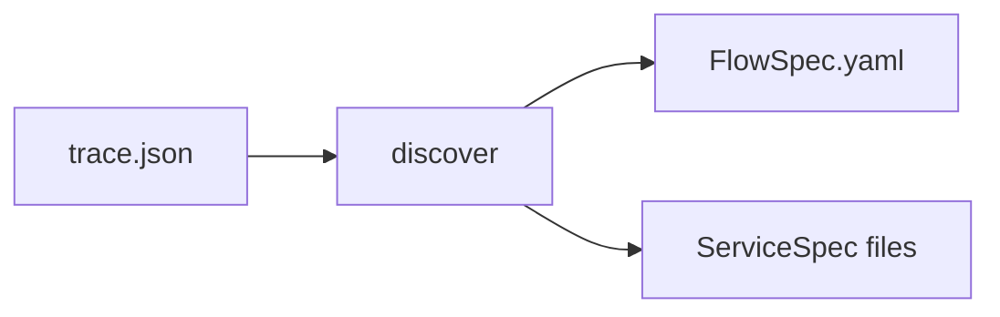

# Discovering FlowSpec from Traces

## Overview

The `discover` command (Atlas Scout) automatically generates initial FlowSpec and ServiceSpec contracts from execution traces. This feature helps bootstrap your Contract-as-Code journey by learning from actual system behavior.

## How It Works



1. **Input**: Takes a trace.json file containing service call sequences
2. **Analysis**: Extracts service interactions, operation calls, and data flow
3. **Output**: Generates dual contracts:
   - FlowSpec defining the choreography
   - ServiceSpec files for each participating service

## Basic Usage

```bash
# Simple discovery
choreoatlas discover --trace trace.json

# With custom output
choreoatlas discover \
  --trace trace.json \
  --out my-flow.yaml \
  --out-services ./specs \
  --title "Order Processing Flow"
```

## Parameters

| Parameter | Description | Default |
|-----------|-------------|---------|
| `--trace` | Path to trace.json file (required) | - |
| `--out` | Output path for FlowSpec | `discovered.flowspec.yaml` |
| `--out-services` | Directory for ServiceSpec files | `./services` |
| `--title` | Title for the generated FlowSpec | "Flow generated from trace" |

## Trace Format

The input trace.json should follow this structure:

```json
{
  "spans": [
    {
      "name": "operationName",
      "service": "serviceName",
      "startNanos": 1000000,
      "endNanos": 2000000,
      "tags": {
        "http.status_code": 200,
        "response.body": {"key": "value"}
      }
    }
  ]
}
```

## Example Workflow

### Step 1: Prepare Your Trace

```json
{
  "spans": [
    {
      "name": "createOrder",
      "service": "orderService",
      "startNanos": 1000,
      "endNanos": 2000,
      "tags": {
        "http.status_code": 201,
        "response.body": {
          "orderId": "ORD-123",
          "status": "created"
        }
      }
    },
    {
      "name": "checkInventory",
      "service": "inventoryService",
      "startNanos": 3000,
      "endNanos": 4000,
      "tags": {
        "http.status_code": 200,
        "response.body": {
          "available": true,
          "quantity": 5
        }
      }
    }
  ]
}
```

### Step 2: Run Discovery

```bash
choreoatlas discover \
  --trace order-trace.json \
  --out order-flow.yaml \
  --title "Order Fulfillment Process"
```

### Step 3: Review Generated FlowSpec

```yaml
info:
  title: "Order Fulfillment Process"

services:
  orderService:
    spec: "./services/orderService.servicespec.yaml"
  inventoryService:
    spec: "./services/inventoryService.servicespec.yaml"

flow:
  - step: "Step1-createOrder"
    call: "orderService.createOrder"
    output:
      orderResponse: "response.body"

  - step: "Step2-checkInventory"
    call: "inventoryService.checkInventory"
    input:
      orderId: "${orderResponse.orderId}"
    output:
      inventoryResponse: "response.body"
```

### Step 4: Review Generated ServiceSpecs

`services/orderService.servicespec.yaml`:
```yaml
service: orderService
operations:
  - operationId: createOrder
    description: Auto-generated from trace
    postconditions:
      status_ok: response.status == 201
```

### Step 5: Refine and Validate

The generated contracts are starting points. You should:

1. **Adjust variable mappings**: Update input/output references
2. **Add preconditions**: Define operation prerequisites
3. **Enhance postconditions**: Add business rule validations
4. **Verify flow logic**: Ensure step sequences match requirements

```bash
# Validate the refined contracts
choreoatlas lint --flow order-flow.yaml
choreoatlas validate --flow order-flow.yaml --trace order-trace.json
```

## Limitations

The current discovery implementation has these limitations:

1. **Basic extraction**: Generates minimal contracts requiring manual refinement
2. **Sequential flow only**: Doesn't detect parallel operations
3. **No variable inference**: Variable references need manual adjustment
4. **Simple conditions**: Only basic HTTP status code postconditions
5. **No CEL generation**: Complex conditions must be added manually

## Best Practices

### 1. Use Representative Traces
- Include both success and failure scenarios
- Cover all typical execution paths
- Ensure traces contain complete tag data

### 2. Iterative Refinement
```bash
# Initial discovery
choreoatlas discover --trace trace.json --out v1.yaml

# Test against original trace
choreoatlas validate --flow v1.yaml --trace trace.json

# Refine and test with new traces
choreoatlas validate --flow v1.yaml --trace trace2.json
```

### 3. Version Control Integration
```bash
# Discover and commit initial version
choreoatlas discover --trace prod-trace.json --out flows/main.yaml
git add flows/ services/
git commit -m "feat: initial contract discovery from production traces"

# Iterate and track changes
vim flows/main.yaml  # Manual refinements
choreoatlas lint --flow flows/main.yaml
git diff  # Review changes
git commit -m "refactor: enhanced contracts with business rules"
```

### 4. CI/CD Pipeline Integration

```yaml
# .github/workflows/discover.yml
name: Contract Discovery
on:
  workflow_dispatch:
    inputs:
      trace_url:
        description: 'URL to trace.json'
        required: true

jobs:
  discover:
    runs-on: ubuntu-latest
    steps:
      - uses: actions/checkout@v3

      - name: Download trace
        run: curl -L ${{ github.event.inputs.trace_url }} -o trace.json

      - name: Run discovery
        run: |
          docker run --rm -v $(pwd):/workspace \
            choreoatlas/cli:latest discover \
            --trace /workspace/trace.json \
            --out /workspace/discovered.yaml

      - name: Create PR
        uses: peter-evans/create-pull-request@v5
        with:
          branch: contract-discovery
          title: "Contract discovery from trace"
          body: "Auto-generated contracts from trace"
```

## Migration Path

For teams with existing systems:

1. **Collect traces**: Export from APM tools (Jaeger, Zipkin, etc.)
2. **Convert format**: Transform to ChoreoAtlas trace.json format
3. **Run discovery**: Generate initial contracts
4. **Validate**: Test against more traces
5. **Enhance**: Add business rules and constraints
6. **Enforce**: Enable in CI/CD pipeline

## Next Steps

- [Schema Reference](../flowspec/schema.md) - Understanding the contract structure
- [Validation Guide](../validation/guide.md) - Testing your contracts
- [GitHub Actions](../ci/github-actions.md) - CI/CD integration