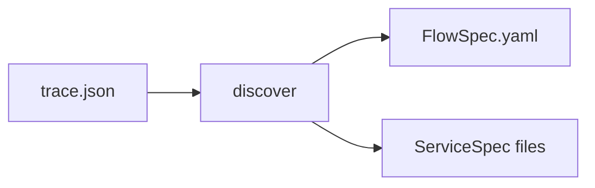

# Discovering FlowSpec from Traces

## Overview

The `discover` command (Atlas Scout) automatically generates initial FlowSpec and ServiceSpec contracts from execution traces. This feature helps bootstrap your Contract-as-Code journey by learning from actual system behavior.

## How It Works


```mermaid
graph LR
    A[trace.json] --> B[discover]
    B --> C[FlowSpec.yaml]
    B --> D[ServiceSpec files]
```

1. **Input**: Takes native trace.json with complete span intervals and optional parent IDs
2. **Analysis**: Preserves call instances, available parent links, and observed timing between adjacent siblings
3. **Output**: Generates dual contracts:
   - FlowSpec DAG describing sampled call structure
   - ServiceSpec files for each participating service

Generation, source structure replay, and schema/lint checks run before destination
files are replaced. A validation failure leaves existing contracts unchanged.
Outputs are prepared together; ordinary commit errors roll back completed file
replacements. This also applies with `--no-validate`, which skips schema/lint checks
but retains source structure replay, staged writes, and rollback. ServiceSpec paths resolve relative to the
generated FlowSpec, including when outputs use different directories.

HTTP operation IDs and runtime matching use the same method/path identity.
Discovery recognizes `http.method` or `http.request.method`, preferring
`http.route`, then `url.path`, `http.target` and `http.url`. A name such as
`GET /health` supplies missing method/path information; supplied attributes take
precedence. Query strings and fragments do not change the operation ID. RPC
operations use `rpc.method`; custom spans retain name-based matching.

Distinct source operations that normalize to the same ID are rejected before
writing contracts, rather than silently merged. Generated HTTP attribute
conditions use `span.attributes["http.method"]` and equivalent exact keys;
status conditions use `response.status`, including `http.response.status_code`.
Generated conditions retain observations shared by all instances of an operation.
Varying or absent values are omitted and noted in the operation description; a
failed retry's response must not become the required response of every attempt.
These sampled conditions still need review before they become business requirements.

Both `discover` and `init --mode trace` emit a DAG with explicit edge relationships:
`parent` verifies a direct parent ID; `follows` verifies completion before start;
`concurrent` verifies overlapping intervals. Parent links and timing relationships
can coexist without switching the entire contract between strict and temporal
semantics. Timing edges describe adjacent sampled siblings, not every possible
pair or a proven business dependency. Without parent IDs, interval overlap cannot
establish a parent-child relationship. Missing external parents are not fabricated.

Every source span becomes a separate node, including repeated operations and
failed retry attempts. Trace IDs, duplicate span identities, timestamps and
parent timing are checked before writing. The generator replays the structure
against the same input under default temporal validation; unsupported or
inconsistent structures fail before any destination is replaced. This replay
checks structure, not business success. Drafts with no common conditions still
need explicit business assertions to satisfy the condition coverage threshold.
Inputs, outputs and response bodies are not inferred or fabricated.

## Basic Usage

```bash
# Simple discovery
choreoatlas discover --trace trace.json

# With custom output
choreoatlas discover \
  --trace trace.json \
  --out my-flow.yaml \
  --out-services ./specs \
  --title "Order Processing Flow"
```

## Parameters

| Parameter | Description | Default |
|-----------|-------------|---------|
| `--trace` | Path to trace.json file (required) | - |
| `--out` | Output path for FlowSpec | `discovered.flowspec.yaml` |
| `--out-services` | Directory for ServiceSpec files | `./services` |
| `--title` | Title for the generated FlowSpec | "Flow generated from trace" |

## Trace Format

The input trace.json should follow this structure:

```json
{
  "spans": [
    {
      "name": "operationName",
      "service": "serviceName",
      "startNanos": 1000000,
      "endNanos": 2000000,
      "attributes": {
        "http.status_code": 200,
        "response.body": {"key": "value"}
      }
    }
  ]
}
```

## Example Workflow

### Step 1: Prepare Your Trace

```json
{
  "spans": [
    {
      "name": "createOrder",
      "service": "orderService",
      "startNanos": 1000,
      "endNanos": 2000,
      "attributes": {
        "http.status_code": 201,
        "response.body": {
          "orderId": "ORD-123",
          "status": "created"
        }
      }
    },
    {
      "name": "checkInventory",
      "service": "inventoryService",
      "startNanos": 3000,
      "endNanos": 4000,
      "attributes": {
        "http.status_code": 200,
        "response.body": {
          "available": true,
          "quantity": 5
        }
      }
    }
  ]
}
```

### Step 2: Run Discovery

```bash
choreoatlas discover \
  --trace order-trace.json \
  --out order-flow.yaml \
  --title "Order Fulfillment Process"
```

### Step 3: Review Generated FlowSpec

```yaml
info:
  title: "Order Fulfillment Process"

services:
  orderService:
    spec: "./services/orderService.servicespec.yaml"
  inventoryService:
    spec: "./services/inventoryService.servicespec.yaml"

graph:
  nodes:
    - id: step-0001
      call: orderService.createOrder
    - id: step-0002
      call: inventoryService.checkInventory
  edges:
    - from: step-0001
      to: step-0002
      relationship: follows
```

### Step 4: Review Generated ServiceSpecs

`services/orderService.servicespec.yaml`:
```yaml
service: orderService
operations:
  - operationId: createOrder
    description: Auto-generated from trace
    postconditions:
      status_ok: response.status == 201
```

### Step 5: Refine and Validate

The generated contracts are starting points. You should:

1. **Adjust variable mappings**: Update input/output references
2. **Add preconditions**: Define operation prerequisites
3. **Enhance postconditions**: Add business rule validations
4. **Verify flow logic**: Ensure step sequences match requirements

```bash
# Validate the refined contracts
choreoatlas lint --flow order-flow.yaml
choreoatlas validate --flow order-flow.yaml --trace order-trace.json
```

## Limitations

The current discovery implementation has these limitations:

1. **Basic extraction**: Generates minimal contracts requiring manual refinement
2. **Sampled structure**: Preserves parent links and adjacent sibling timing; one trace does not establish all allowed paths or business dependencies
3. **No variable inference**: Variable references need manual adjustment
4. **Observed conditions**: Only shared sampled observations become conditions; varying retry outcomes need an explicit policy
5. **No business-rule inference**: Complex conditions must be added manually

## Best Practices

### 1. Use Representative Traces
- Include both success and failure scenarios
- Cover all typical execution paths
- Ensure traces contain complete attribute data

### 2. Iterative Refinement
```bash
# Initial discovery
choreoatlas discover --trace trace.json --out v1.yaml

# Test against original trace
choreoatlas validate --flow v1.yaml --trace trace.json

# Refine and test with new traces
choreoatlas validate --flow v1.yaml --trace trace2.json
```

### 3. Version Control Integration
```bash
# Discover and commit initial version
choreoatlas discover --trace prod-trace.json --out flows/main.yaml
git add flows/ services/
git commit -m "feat: initial contract discovery from production traces"

# Iterate and track changes
vim flows/main.yaml  # Manual refinements
choreoatlas lint --flow flows/main.yaml
git diff  # Review changes
git commit -m "refactor: enhanced contracts with business rules"
```

### 4. CI/CD Pipeline Integration

```yaml
# .github/workflows/discover.yml
name: Contract Discovery
on:
  workflow_dispatch:
    inputs:
      trace_url:
        description: 'URL to trace.json'
        required: true

jobs:
  discover:
    runs-on: ubuntu-latest
    steps:
      - uses: actions/checkout@v3

      - name: Download trace
        run: curl -L ${{ github.event.inputs.trace_url }} -o trace.json

      - name: Run discovery
        run: |
          docker run --rm -v $(pwd):/workspace \
            choreoatlas/cli:latest discover \
            --trace /workspace/trace.json \
            --out /workspace/discovered.yaml

      - name: Create PR
        uses: peter-evans/create-pull-request@v5
        with:
          branch: contract-discovery
          title: "Contract discovery from trace"
          body: "Auto-generated contracts from trace"
```

## Migration Path

For teams with existing systems:

1. **Collect traces**: Export from APM tools (Jaeger, Zipkin, etc.)
2. **Convert format**: Transform to ChoreoAtlas trace.json format
3. **Run discovery**: Generate initial contracts
4. **Validate**: Test against more traces
5. **Enhance**: Add business rules and constraints
6. **Enforce**: Enable in CI/CD pipeline

## Next Steps

- [Schema Reference](../flowspec/schema.md) - Understanding the contract structure
- [Validation Guide](../validation/guide.md) - Testing your contracts
- [GitHub Actions](../ci/github-actions.md) - CI/CD integration
